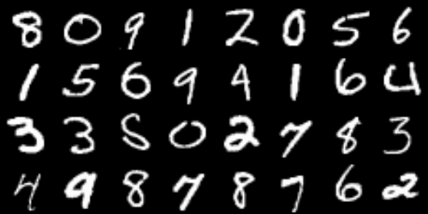
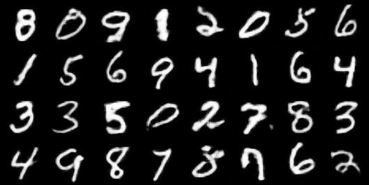

# Conditional GAN
## Overview

Here you can find Conditional Gan implementation. Talking about details, this implementation works only with finit number of classes. For example, you can train this model to generate man or woman, or MNIST number, but it won't work with queries like "blue-eyed blonde woman" or "handwritten one with underline". To work with labels, this implementation uses embedding layer in both Critic (Discriminator, generally, but here I use WGAN model so it's called Critic) and Generator models.

[Here](https://www.kaggle.com/code/nikolaimakarov/conditional-gan-implementation-and-training) you can find my kaggle notebook with implementation and training. There is also a wandb logging where you can observe progress in learning.

As you may notice, the generator's output is quite good, so this Conditional GAN variation works well.

Real MNIST

Generated samples