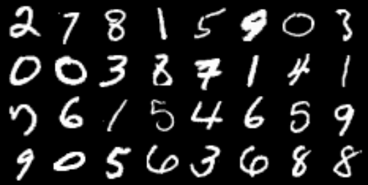
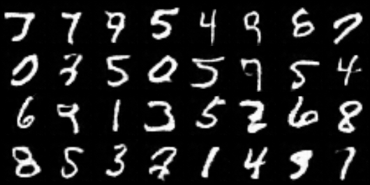

# DCGAN implementation
## Overview
The subproject based on [this](https://arxiv.org/abs/1511.06434) paper. Here you can find models' architecture and training script - it's written for MNIST generation, but you can easily change it for any dataset.

[There](https://www.kaggle.com/code/nikolaimakarov/dcgan-implementation-and-training?scriptVersionId=158369377) you can find my kaggle notebook with implementation, training, wandb logging. In the output you can also find saved weights.

Talking about trainig result, I've trained this model during 15 epochs, here you can this the result:

Real MNIST

Generated samples

This dataset is quite simple, but generation result are quite good, so I think that my implementation works.
