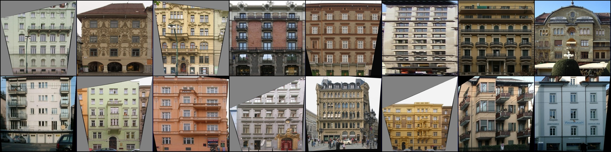
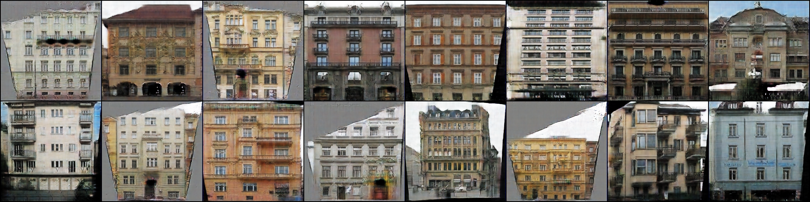

# Pix2Pix
## Overview

Here you can find my implementation of Pix2Pix GAN, proposed in [this](https://arxiv.org/abs/1611.07004) paper.

I've trained my model for 500 epochs on label to facade dataset, but without a doubt you can change Pix2PixDataset in the case of another dataset. For example, you can add more augmentations. [There](https://www.kaggle.com/code/nikolaimakarov/pix2pix-implementation-and-training/notebook) you can find my kaggle notebook with implementation and training. There is also weights and biases logging, so you can check it in the case you want to see model's output dynamically. 

So let's take a look at the last epoch model's output.

Target images

Generated images

These images totally not cherry-picked, so we can see model's real output. Some of these facades look well, only details indicate that these are fake images. Also some samples look worse, but they are not totally bad.

So I can say that this implementation works well.